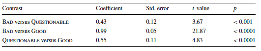

# The paper
* The paper I am presenting is [Chen, Z., Xu, Y., & Xie, Z. (2020). Assessing introspective linguistic judgments quantitatively: The case of The Syntax of Chinese. *Journal of East Asian Linguistics*, 29(3), 311-336.] You can find this paper [here](https://link.springer.com/article/10.1007/s10831-020-09210-y).
---
# The research question

* **Background and motivation**: 

  + The informal judgments of the well-formedness of phrases and sentences have long been used as the primary data source for syntacticians.
  + People wonder if the introspective and informal acceptability judgments from syntacticians is truly consistent with those of native speakers of the target language.
- **Research question**: 

  + Can the introspective judgments in a recent and frequently used Chinese syntax textbook, *The Syntax of Chinese* (by C.-T. James Huang, Y.-H. Audrey Li, and Yafei Li, 2009, Cambridge University Press, henceforth, HLL), be replicated?
  
- Two experiments were conducted in this study.
---
# Experiment 1- overview
- Experiment 1 is an acceptability rating experiment assessing Chinese native speakers’ judgments of the sentence examples in the book.

- **Materials:** 557 sentences into three categories: the "good" sentences, the “bad” ones and the "questionable" ones. They occur in PAIR contrasts (good/bad), TRIPLE contrasts (good/questionable/bad) or are independent.

- **Procedure:** Sentence items were presented one at a time which participants rated on a scale from 1 (very bad) to 7 (very good).

- **Randomizing the tested sentences:**  two/three sentences in PAIR or TRIPLE contrasts will go to different groups and judged by different participants. 
---
# Experiment 1- statistics summary
What they did | How | Why | Figure
--------------|-----|-----|-------
to test if there is significant differences among good, bad and questionable sentences| two-tailed paired t-tests | the predictors are categorical | (1)
to evaluate the effects of gender, age and education of participants|a linear mixed-effects model|the predictors are categorical and continuous |
to examine whether the judgments are stable and therefore reliable over time| scatter plot| to show the distribution | (2)
to examine whether good examples are always better than bad examples| 2 scatter plots | to show the distribution| (3)(4)
show the outliners | facets | for next experiment | (5)
---
# Experiment 1- (1)


---
# Experiment 1- (2)
```{r,echo=FALSE}
library(knitr)
knitr::include_graphics("/Users/Chaoyi/Desktop/online presentation/2.png")
```
---
# Experiment 1- (3)
```{r,echo=FALSE}
library(knitr)
knitr::include_graphics("/Users/Chaoyi/Desktop/online presentation/3.png")
```
---
# Experiment 1- (4)
```{r,echo=FALSE}
library(knitr)
knitr::include_graphics("/Users/Chaoyi/Desktop/online presentation/4.png")
```
---
# Experiment 1- (5)
```{r,echo=FALSE}
library(knitr)
knitr::include_graphics("/Users/Chaoyi/Desktop/online presentation/5.png")
```
---
# Appropriateness/novelty of analysis
  + The two-tailed paired t-test is an appropriate analysis for the cases where we want to see if there is any significant differences among categorical predictors; 
  
  + The linear mixed-effects model is an appropriate (and convinient) way to test the main effects of both categorical and continuous variables.
  
  + The statistical methods used in this study were all covered in our course. 
  
  + One possible problem for this analysis is that a Likert scale item is in fact a set of ordered categories but the authors treated them as if it were continuous in the study. Some scholar argue that for ordered categories, the intervals between the scale values are not equal. Any mean, correlation, or other numerical operation applied to them is invalid. 
---
# Presentation of results

  + They properly explain and interpret their results. They gave the detailed results of their studies, including F and t-values. Further,they used the p< 0.001 and 0.0001 to support their hypothesis that there are significant differences among good, bad and questionable sentences. This is a correct interpretation of the results.
  
  + They use tables/graphs to present the results they got. The graphs are clear and easy to read.

---
# Overall evaluation in Experiment 1

+ They used appropriate statistic methods and models to examine their hypotheses and present each result they got with graphs and tables  
+ However, their treating an ordered variable as if it were continuous may lead to some problems.

+ What is noteworthy in this study is that they singled out the outliners and conducted a follow-up experiment on them (experiment 2).

---
# Experiment 2- overview
- **Background:** Syntactic researchers focus on the difference between candidates that are of theoretical interest within a particular contrast.

- Experiment 2 is a forced-choice task re-testing all 17
PAIR contrasts identified in Experiment 1 with non-significant difference between the two members to see if we can get the significant difference in this contrast setting.

- **Materials:** Apart from the test group (17 PAIR contrasts in question), they also created two Control Groups 
  + Control 1 group: 27 Pair contrasts whose rating differences were the most significant in Experiment 1; 
  + Control 2 group: 9 Pair contrasts whose rating difference reached significance in the z-transformed data but failed do the same when the raw data were analyzed
  
- **Procedure:** Participants simply read and chose the better sentence from each pair.
---
# Experiment 2- statistics summary
What they do | How | Why | Figure
-------------|-----|-----|
to test if the proportion of choosing a “good” sentence as the better one was significantly higher| fitting binominal mixed effects model/logistic regression | dependent variables are categorical| (1)
to verify if the difference is significant for each pair | facets |to look into individual differences|(2)
---
# Experiment 2- (1)
```{r,echo=FALSE}
library(knitr)
knitr::include_graphics("/Users/Chaoyi/Desktop/online presentation/6.png")
```
---
# Experiment 2- (2)
```{r,echo=FALSE}
library(knitr)
knitr::include_graphics("/Users/Chaoyi/Desktop/online presentation/7.png")
```
---
# Appropriateness/novelty of analysis

  + This experiment used a method we haven't covered in this course yet (as of April 5)---logistic regression. 
  
  + Logistic regression is appropriate for the case where we need to model a binary dependent variable. In this case, the good/better choice is a dependent variable.
  
  + Apart from showing the general patterns of the data, they also split the plot into facets and made a clear case-by-case comparison to single out the cases where more participants chose the "bad " sentences as good sentences for further studies. 
---
# Presentation of results
  + They properly explained and interpreted their results. They gave the detailed results of their studies (p-value). Further,they used the p< 0.001 and 0.05 to support their hypothesis that the judgment of “good” sentence as the better one was significantly higher in all these three groups. This interpretation is correct.
  
  + They used tables/graphs to present every result they got. The graphs are clear and easy to read.
---
# Overall evaluation in Experiment 2

+ They used appropriate statistic methods and models to examine their hypotheses and present every result they got with graphs and tables.

+ In this experiment, they also paid attention to the outliners. Even under the contrast condition, we still got five pairs showing that bad sentences are judged to be good. This will lead us to investigate more on these individual cases.

+ Nonetheless, I don't think that two control groups are not well motivated and play any role in this study.